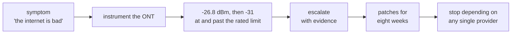
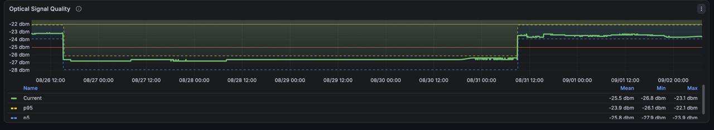

# The problem

Residential internet in Kathmandu is cheap and plentiful. It is not reliable:
any single line will, some weeks, simply stop for hours, and the fault is as
likely to be a cable on a pole as anything in the provider's network.

Two connections mean accepting that half as often — if they fail
independently. What independence actually costs, and whether you can buy it,
is the question this network exists to answer.

## The provider that started it

ISP0 is Worldlink — 600/300 until October 2026, then 400/200 — and, on paper,
the obvious primary. It worked fine at the previous address, at about
**-13 dBm**. At this one, Worldlink's own installers measured **-27 dBm** on the
day they connected it, 27 July, and left without fixing it. It stayed that way
for eight weeks, until a repair on 20 September brought it to about -17 dBm.



### Instrumenting the black box

ISP-supplied routers are black boxes: "slow internet", and no way to tell
whether the fault is the WiFi, the fibre or the provider. Every conversation
with support starts from zero because neither side has data.

So the first thing built here was not redundancy but a Prometheus exporter for
the ONT itself: [`ont-exporter`](https://github.com/thapabishwa/ont-exporter),
40+ metrics scraped off a Nokia G-1426G-A, including the one that mattered —
**PON optical receive power**.

### What it found

Receive power did not sit at one level. It moved in steps:



It held near **-23 dBm**, fell to about **-26.8 dBm** within minutes on
26 August, stayed there four and a half days, and stepped back to about
-23.5 dBm on 31 August. The provider's own app has shown worse since:

| provider app, date | optical level | upstream BER counter | downstream BER counter |
|---|---|---|---|
| [4 September](images/isp0-app-27dbm.png) | -27 dBm | 152 | 0 |
| [19 September](images/isp0-app-31dbm.png) | **-31 dBm** | **14,504,397** | **2,919,972** |

GPON Class B+ optics, the class residential ONTs ship with, are rated to
receive down to **-27 dBm** (ITU-T G.984.2 Amd 1). A healthy drop has several
dB of headroom above that.

```
  -8 dBm  ┤ overload limit
          │
 -13 dBm  ┤ ●  the previous address — Worldlink worked fine here
          │
 -23 dBm  ┤ ●  this address, the good weeks
          │
 -26.8    ┤ ●  26–31 August, four and a half days   ← 0.2 dB of margin
 -27 dBm  ┤ ─────────── rated sensitivity (Class B+) ───────────
          │
 -31 dBm  ┤ ●  the provider's own app, error counters in the millions
```

**The fault is mechanical, not environmental.** Temperature drift is slow and
small. A 3.8 dB step that happens in minutes and holds for days is something in
the path switching between two states — a connector, splice or bend that moves.
Same provider, same service, fine at the old address, and installed at the
limit: the suspect was this address's drop, not Worldlink's network. It was.
The area has two distribution boxes, and the installers had run the drop from
the older one. The repair was moving it to the newer box — at the customer's
request, not the provider's diagnosis.

**On its bad days the link runs at or past its rated edge.** At -27 dBm the
error counters barely move; at -31 they are in the millions. Forward error
correction hides errors until it cannot, and then frames are lost outright or
the ONT re-registers. So the link does not get slower — it disappears, and
comes back.

None of this was hidden from the provider: their own app coloured both readings
red.

## The symptom

Exactly what the mechanism predicts — clean for fifty minutes, absent for two,
repeatedly, with nothing in between:

| | measured overnight, 119 samples per ISP |
|---|---|
| mean loss | **2.42%** |
| intervals above 5% loss | **11 of 12** |
| worst | a complete blackout, 05:53 to 06:05 |
| lifetime | 226 of 9858 probes failed |

ISP1 over the same period: 0.34% mean, one interval above 5%. ISP2: **0.00%**,
zero failures in 9858 probes.

A link losing 2.4% steadily is annoying; one that is flawless and then gone is
unusable for anything with a session — calls drop, SSH hangs, transfers
restart. The mean hides that, which is why the [scoring](06-control-loop.md)
weights severity rather than counting incidents.

It is not load-dependent either: the link was idle, 0 Mbps, during its worst
intervals. That rules out congestion and points at the physical layer, which
needs a technician, not a reboot.

## How long escalation took

"2.42% packet loss" invites an argument about whether the measurement is fair.
A list of every complete dropout, timestamped by the router, does not:

```sh
kubectl -n homenet exec deploy/dash-agent -- cat /data/log/isp-events.log \
  | awk '/ISP0 DOWN/{split($1,d,"T"); c[d[1]]++} END{for(k in c) print k, c[k]}' | sort
```

On 24 and 25 September that produced dozens per day.

Redundancy was not the first response. It came after six weeks of waiting:

| when | what |
|---|---|
| 27 July | moved; Worldlink's installers measure -27 dBm, at the rated limit, and leave it (about -13 dBm at the old address) |
| late July | fault reported in person at Worldlink's office; no response |
| August–September | reported repeatedly; each visit a temporary patch, the fault back within one or two days |
| by 26 August | ONT exporter running; receive power steps to -26.8 dBm |
| 4 September | provider's app reads -27 dBm |
| 10 September | **NTFiber activated — the first second line; its fibre was already in place, so it only had to be paid for** |
| 18 September | Vianet installed |
| 19 September | provider's app reads -31 dBm |
| 20 September | **Worldlink moves the drop to the area's newer distribution box, as asked — about -17 dBm** |
| 23 September | a pole cut takes out both new lines for 64 hours ([Failure domains](02-failure-domains.md)) |

Until 10 September Worldlink was the only line; the redundancy described
here is under a month old.

The evidence was unusually good — the provider's own readings, a rated limit, a
mechanism that predicts the symptom, and a time series. For eight weeks it
produced patches that held a day or two; the real repair came on the provider's
schedule, after the backup lines were already in. Since then ISP0 has lost a
few minutes a day at most, in brief blips.

## And then the problem moved

Eight days later the lifetime probe figures had inverted:

| | failed probes, lifetime |
|---|---|
| **ISP0** Worldlink | **0.15%** |
| ISP1 Vianet | **2.05%** |
| ISP2 NTFiber | 1.72% |

The link this chapter is about is now the steadiest of the three. The one I lose
most often is ISP1: on 28 September it lost every probe six separate times, the
longest for 6m47s.

It is a different kind of problem, and a harder one to see. ISP0's was optical —
a number I could read, compare against a rated limit, and watch step between two
states. ISP1's shows up as the hEX losing its route to `192.168.2.1`, one hop
away on my side of the trunk, which took a day of log reading to pin down at all.
See [Incidents](08-incidents.md).

What I took from it: **the instrument you build for one problem is what finds
the next one, somewhere you were not looking.** The ONT exporter existed to give
me a number for a link I otherwise could not see. The probes that eventually
caught ISP1 existed only because of that — and for months they had been
recording that failure as a success, because I had never checked what the error
strings actually meant.

So the habit matters more than any one fix: measure the thing you depend on,
keep measuring after it stops being the thing that hurts, and check that your
instruments still mean what you think they mean. Everything that follows is
that, applied.

---

[← Introduction](../README.md) · [Failure domains, not providers →](02-failure-domains.md)
