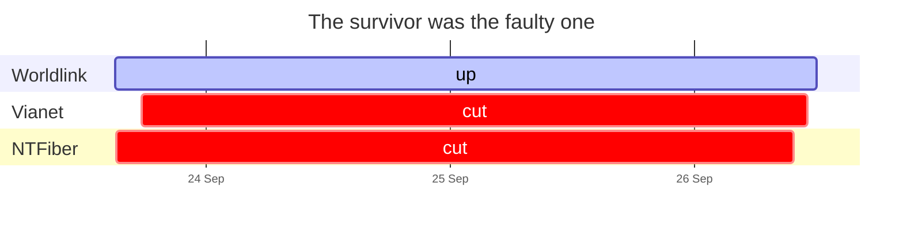
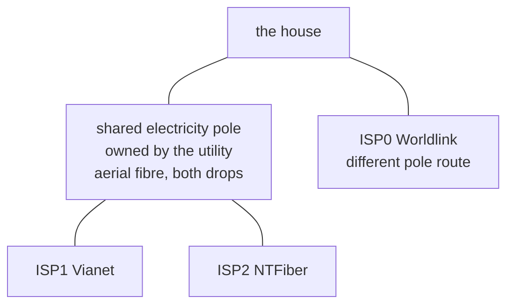
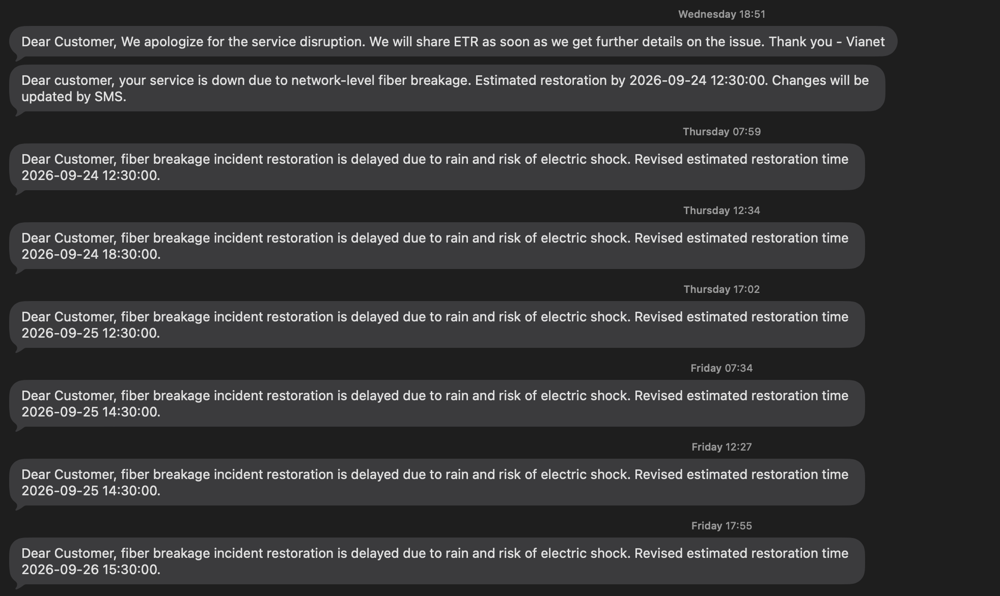

# Failure domains, not providers

Two links protect against one provider having a bad day. They do not protect
against what actually happened.

## The cut

On 23 September NTFiber went down at 15:05 and Vianet at 17:35. Neither came
back until the 26th.

| | cut | restored | out for |
|---|---|---|---|
| ISP2 NTFiber | 23 Sep 15:05 | 26 Sep 09:43 | **67 hours** |
| ISP1 Vianet | 23 Sep 17:35 | 26 Sep 11:04 | **65 hours** |

Both were down together for **64 hours**, from 17:35 on the 23rd to 09:43 on
the 26th. The survivor was Worldlink — repaired only three days earlier after
an eight-week [optical fault](01-the-problem.md) — so for those 64 hours the
house ran on one connection, still blipping dozens of times a day, with
failover working perfectly and nowhere to go.

The two networks are unrelated: different companies, equipment and upstreams.
On paper they are as independent as two providers can be.

**Their fibre was strung on the same electricity pole, and the pole had become
unsafe.**

Aerial fibre is how last-mile is built here: drop cables run along the power
distribution poles. These were not damaged by accident — they were cut
*deliberately*, as part of dealing with the pole. So the shared dependency is
not just proximity; it is **shared exposure to a third party's maintenance
decisions**. The utility owns the pole, has no contract with the household or
either ISP, and no reason to coordinate. When a pole must come down, every
carrier on it goes too, on the utility's schedule. Buying more connections from
more companies cannot fix that, because none of them controls the risk.

Worldlink comes in on a different pole route, which is the only reason anything
survived:

No network diagram, traceroute or contract shows this. It is only visible by
standing outside and looking up — or by losing two providers within hours and
asking why.

Three providers, **two failure domains**. The most useful thing this project
has produced is not a configuration but the knowledge that a fourth provider
adds nothing unless its fibre reaches the building on a different pole route.

## Why it took three days

Vianet said why, by SMS, eight times:

| sent | promised restoration | lead | outcome |
|---|---|---|---|
| Wed 18:51 | — | | acknowledged, ETR to follow |
| Wed 18:51 | Thu 12:30 | 17.6h | missed |
| Thu 07:59 | Thu 12:30 | 4.5h | missed |
| Thu 12:34 | Thu 18:30 | 5.9h | missed |
| Thu 17:02 | Fri 12:30 | 19.5h | missed |
| Fri 07:34 | Fri 14:30 | 6.9h | missed |
| Fri 12:27 | Fri 14:30 | 2.0h | missed |
| Fri 17:55 | **Sat 15:30** | 21.6h | **beaten by 4.4h** |

Every revision cited the same cause: **rain and risk of electric shock**. The
fibre hangs on a live pole, splicing it in the rain can kill someone, and it
was monsoon season. Service returned Saturday 11:04.

Seven estimates, six misses — but they were not really forecasts. Four of the
six revisions arrived *before* the deadline they replaced, roughly twice a day,
with short leads in working hours and long ones at close of business. That is a
**heartbeat**: *still here, still blocked, same cause.* Its content is
liveness, not timing, and for a customer who cannot affect the repair, liveness
is the useful signal. The mistake was labelling it "estimated restoration
time", which invites planning around it; "still blocked, next update 18:00"
would have cost no trust. The same split — liveness separate from events —
shaped this network's own [notifications](07-measurement.md#from-measurement-to-notification).

**This is not a story about a bad ISP.** Vianet noticed unprompted,
acknowledged within 76 minutes, gave a real cause, kept a steady cadence and
beat its final estimate. The delay was weather and a safety rule — which is
exactly what makes it unbuyable. No support tier sends a technician up a live
pole in a storm, and none should.

Keep that separate from the ISP0 fault, which *is* a complaint about a
provider: measured evidence, a rated limit, a clear mechanism, and eight weeks
of patches before a repair. Two providers were blocked by something real. One
was not blocked by anything.

---

[← The problem](01-the-problem.md) · [Reliability without authority →](03-reliability-without-authority.md)
