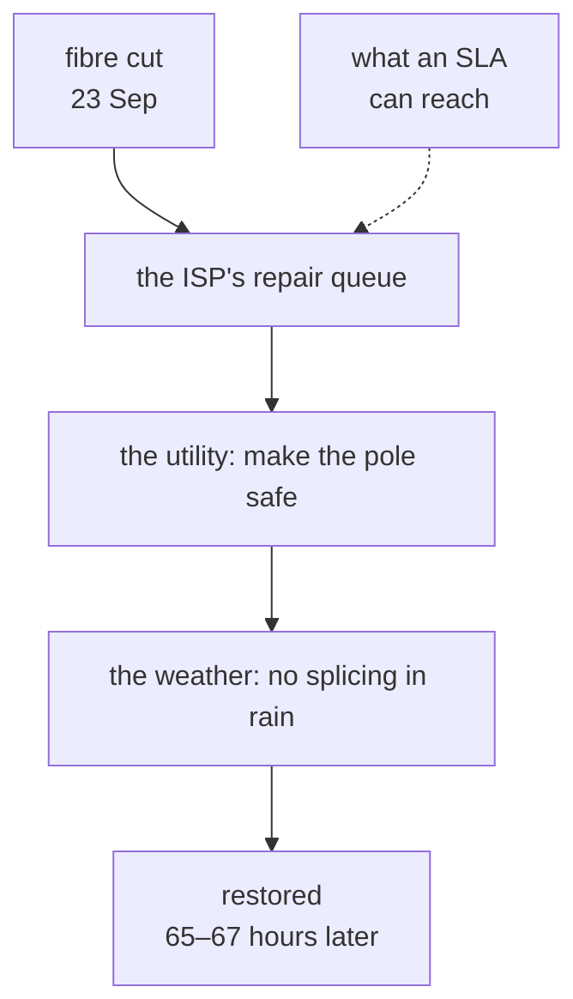

# Reliability without authority

Most reliability engineering assumes you can change the thing that is failing:
you own the service, deploy the fix, and negotiate an error budget that gives
you leverage.

None of that applies here. The fault was in a provider's fibre. A consumer
connection has no SLA, no error budget, no escalation path that reliably
produces a technician, and no contract term that turns measurements into
action. So the question is not "what reliability do I commit to?" but:

> **What availability can I construct from components I cannot fix and cannot
> compel anyone to maintain — but can replace?**

That is the same shape as depending on a third-party API, a single-region
managed service, or a vendor who resells someone else's backbone. You are not
the operator. You are exposed to one.

## Five levers

| lever | what it does here |
|---|---|
| **Measure** | the provider shows one reading at a time; you keep the history. Without the ONT exporter, "slow internet" never becomes "-26.8 dBm against a -27 dBm limit, for days" |
| **Compose** | three unreliable links, arranged so one failing is not an outage |
| **React fast** | a dead link is routed around in about two seconds — measured twice — so a video call survives it and new connections work long before anyone reports a problem |
| **Reduce what depends on it** | tiers, so a bad link degrades one class of device rather than everyone |
| **Replace** | providers are slots; swapping one costs its installation lead time and nothing on this side. See [Exit strategy](10-exit-strategy.md) |

What you cannot do is make the underlying link better. Every design decision
downstream follows from accepting that.

## The target is human, not numeric

With no SLA to negotiate against, any percentage would be arbitrary. The
objective is behavioural:

> **A video call should not drop. An SSH session should not die. Nobody should
> have to ask whether the internet is working.**

That still converts into design. Applications tolerate a gap of a few seconds,
so a dead link must be detected and left **within seconds, not minutes** —
hence the ten-second probe interval and immediate failover off a dead primary.
*Returning* to a recovered link can wait fifteen minutes, because a premature
return risks exactly what the objective forbids.

The [drills](13-runbooks.md#drills) also showed the objective's limit, and
then how far speed can push it. Every link is behind its own NAT, so failover
changes the public address a session is using. At 14.6 s the call dropped; at
2.0 s it survived. Speed bounds the gap, but it does not remove the hazard —
an application that cannot reconnect by itself is still at the mercy of how
long the gap happens to be.

## Two things this cannot claim

**The measurements are not a contract.** They are evidence for a conversation
the provider is not obliged to have. They change the conversation even when
they do not change the outcome.

**Composition has a floor.** Three providers turned out to be
[two failure domains](02-failure-domains.md). No routing survives both being
cut at once. Constructed availability is bounded by the physical independence
you actually have, not the number of bills you pay.

## What it costs, and what money cannot buy

Three consumer lines were chosen over one business-grade line with a support
contract. At published list prices (September 2026, VAT included):

| | line | per year |
|---|---|---|
| ISP0 Worldlink | 400 Mbps | ~Rs 16,500 |
| ISP1 Vianet | 400 Mbps | Rs 15,600 |
| ISP2 NTFiber | 200 Mbps | ~Rs 16,500 |
| **three lines** | **1,000 Mbps** | **~Rs 48,600** — about Rs 4,050 a month |

The business plan in the same class is Worldlink's **Biz24 Grow**: 300–600 Mbps
for Rs 73,450 a year with VAT. Vianet's SOHO range tops out at 175 Mbps for
about the same money, Worldlink's SME+ at 150 Mbps. The three residential lines
are **about 34% cheaper** than one business line of the same class.

The lines are the recurring cost. The hardware is one-off:

| | qty | Rs |
|---|---|---|
| MikroTik hEX | 1 | 11,000 |
| TP-Link TL-SG108E | 1 | 5,000 |
| mini DC UPS — each ONT, the switch, the hEX, each AP | 7 | 14,000 |
| **total** | | **30,000** |

The CPEs are the providers'. Against the business line, the ~Rs 24,850 a year
saved on lines pays for the hardware in about fifteen months — somewhat sooner,
since a business line would still need UPSes for its own router and APs.

What the business tiers add is real: a public static IP, priority support, a
business router, and (Vianet SOHO) no sharing ratio, 24×7 phone support and an
in-network speed guarantee. None publishes an uptime figure or a restoration
time.

The price leaves out the largest cost: **someone has to operate this.** A
business line is one box, one bill, one number to call. Three residential lines
are three bills, three support queues, three CPEs and UPSes, plus a controller,
Terraform and monitoring — and every incident lands on the one person who
understands them. It is worth paying only because the operator works from this
network full-time and would otherwise pay in lost working hours. See
[Own failure domains](11-own-failure-domains.md).

But cost is the weaker half of the argument. **The expensive option would not
have helped.** A Vianet or NTFiber business plan runs over the same fibre on the
[same pole](02-failure-domains.md), cut by the same decision, and would have
waited for the same weather. A Worldlink business plan would have survived —
only because Worldlink uses a different pole route, which argues for a second
path, not a pricier one.

An SLA reaches the first box. The delay lived in the third.

| | three consumer lines | one business line |
|---|---|---|
| monthly cost | ~Rs 4,050 | ~Rs 6,100 (Biz24 Grow) |
| bandwidth | 400 + 400 + 200 | 300–600 |
| public address | none, all carrier NAT | one static IP |
| support | standard queues | priority |
| published uptime or restoration time | none | none |
| commitment | a month, a quarter or a year | a year upfront |
| who operates it | you | the provider |
| **physical paths** | **two** | **one** |
| response to a cut | seconds, automatic | a ticket, then a van |
| survives the 23 September cut | yes | only if it is Worldlink's |

**Paying more for a higher tier of the same dependency does not remove the
dependency.** A single provider's upgrade path is more service on the same
cable — support, hardware, a static address — and none of it is a second
physical path. The same mistake is easy at work: a higher support tier on a
managed service, multi-AZ in one region, two vendors reselling the same
backbone. The invoice goes up; the failure domain does not change.

What three lines buy is **the option not to need any particular company on any
particular day** — bounded by how much physical independence you actually got.

---

[← Failure domains, not providers](02-failure-domains.md) · [Architecture →](04-architecture.md)
