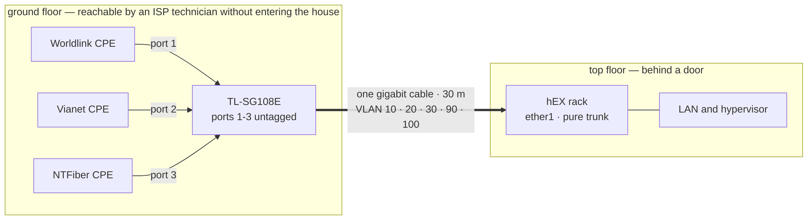
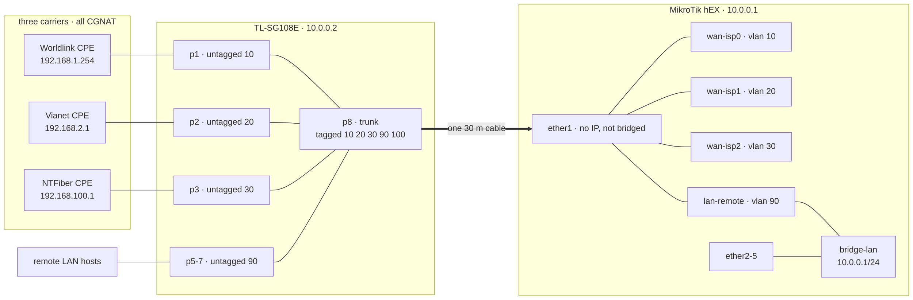

# Architecture

## Why the CPEs are downstairs

The three ISP routers live on the ground floor, by the building entrance —
deliberately, and everything else follows from it.

**ISP support needs physical access to its own equipment.** Every provider's
first move on a fault is to come and look at the box. Indoors, every visit
means being home and letting a stranger in. With three providers that is three
dispatch queues — one of them for an [optical fault](01-the-problem.md) that
took eight weeks of visits.
Now a technician can do the work in the entrance area and leave.

It is only a partial security boundary. The router, hypervisor and rack stay
behind a door, but the switch has to sit with the CPEs, and its ports 5–7 are
untagged LAN (VLAN 90, bridged into `bridge-lan`). Anyone standing at it can
plug in and land on the home network, or reach the switch's management. The
door protects the rack, not the LAN.

## What that forces

The router is upstairs, about **thirty metres** of cable run from the
entrance. Three separate cables were never realistic, so **one gigabit cable**
carries everything and each ISP becomes a VLAN tag on it. `ether1` is a pure trunk — no IP address, not in any bridge.

**This is also the throughput ceiling.** Three lines summing to 1000 Mbps
share one gigabit trunk — which also carries the remote LAN — so the aggregate
can never exceed about 940 Mbps. A decision made for human reasons sets the
hard limit, knowingly: the alternative is three sets of contractors in the
house on someone else's schedule.

## The trunk

VLAN 40 is reserved and 100 carries switch management; the hEX terminates only
10, 20, 30 and 90. `ether1` is deliberately a member of the **WAN** interface
list rather than LAN — the switch's own management CPU answers on that trunk,
so it is treated as untrusted and the input chain drops it.

**"All CGNAT" was confirmed for all three links on 5 October 2026, and a
traceroute cannot show it.** Over Worldlink and Vianet, the hop after the CPE
is public (202.166.192.2, 43.245.84.97), which reads like a public WAN
address. It is not one. The shared address is on the CPE's own WAN side, and a
traceroute never lists it: the carrier's first router answers from whatever
address it chooses, and the NAT step does not answer at all. Only NTFiber
shows it in a trace, and only because it numbers its first router in private
space (10.133.0.1). The test that settles it is the CPE's WAN address on its
status page against what `curl -s https://ifconfig.me` returns over that link.
Different addresses mean carrier NAT. To trace a single link from the router,
target one of its probe pins (`/tool/traceroute 8.8.8.8` for ISP0,
`8.8.4.4` for ISP1, `208.67.220.220` for ISP2): RouterOS v7 has no `routing-table=` on traceroute.

| | line | shaped at | CPE hands us |
|---|---|---|---|
| **ISP0** Worldlink | 400 / 200 | 380M / 186M | `192.168.1.x` by DHCP |
| **ISP1** Vianet | 400 / 200 | 380M / 186M | `192.168.2.2` static |
| **ISP2** NTFiber | 200 / 100 | 190M / 95M | `192.168.100.x` by DHCP |

ISP1's CPE does not answer DHCP at all (nine DISCOVERs over 24 seconds, no
reply), so that one address is static. Every DHCP client runs with
`add-default-route=no`: a route installed by the lease would fight the
controller for the one attribute it owns.

Every link is behind carrier NAT, so **no inbound port forwarding exists on any
of them**; anything reachable from outside is an outbound tunnel, and adding
links does not change that. Shaping runs at 93–95% of line rate to own the
queue: if the bottleneck sits in the ISP's buffer, fq_codel has nothing to
schedule and the bufferbloat happens upstream, out of sight.

---

[← Reliability without authority](03-reliability-without-authority.md) · [Device tiers →](05-tiering.md)
