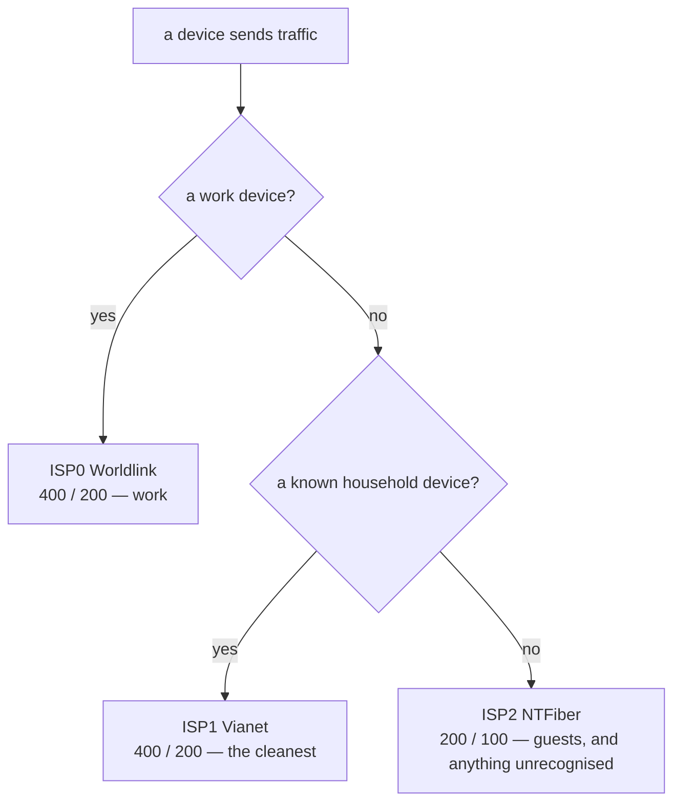

# Device tiers

There is no per-flow load balancing. Each **class of device** gets one link and
keeps it.

The router asks three questions, in order, about where a packet came from:

## Why classes of device, not classes of traffic

Classifying traffic asks *what kind of packet is this?* and needs deep
inspection and port lists that rot as applications change. Asking *whose
device is this?* needs none of that: a work laptop is a work laptop whether it
is on a call or idle.

It also degrades comprehensibly. When Worldlink flaps, the effect is "my work
machine is having a bad time", not the apparently random mix of working and
broken connections per-flow balancing produces on unequal links.

## The third question is not a list

Nobody enumerates guests. `10.0.0.160/27` is the only part of the network that
DHCP hands out dynamically — every known device has a reservation outside it.

So an unrecognised device gets a dynamic address by definition, that address
falls in the pool, and the pool routes to NTFiber. **Unknown means guest**,
automatically, with no one maintaining a list.

A policy built on enumeration is wrong the moment someone brings a new phone;
one built on a sink is right by default and needs attention only to *promote*
something.

## How the router actually knows

Purely by source address, which is why the DHCP reservations in
[`addressing.tf`](../terraform/addressing.tf) are load-bearing rather than a
convenience:

| class | matches | link |
|---|---|---|
| infrastructure | the router itself, LAN-local traffic, the three CPE subnets | stays local |
| work | pve, the wired Macs, the `10.0.0.16/28` block | ISP0 |
| guest | `10.0.0.160/27`, the dynamic pool | ISP2 |
| household | everything else in the `/24` | ISP1 |

Order matters and is enforced: the household rule matches the entire subnet, so
anything evaluated after it is dead configuration.

The infrastructure row keeps the CPEs reachable for diagnosis and leaves the
router's own traffic — DNS, NTP, package fetches — on `main`, following the
global primary rather than any class's preference. It is checked first because
the household rule matches the whole subnet, the router included.

MAC randomisation had to be disabled on the Macs before any of this worked. A
device that changes its hardware address every few days cannot hold a
reservation, so it lands in the guest pool — correct behaviour, confusing
outcome.

## Every table carries all three links

This makes tiers a reliability feature, not just a preference. A tier is not
pinned to one ISP — it *prefers* one:

| table | 1st | 2nd | 3rd |
|---|---|---|---|
| `main` | follows the global primary | | |
| `via-isp0` (work) | ISP0 | ISP1 | ISP2 |
| `via-isp1` (household) | ISP1 | ISP0 | ISP2 |
| `via-isp2` (guest) | ISP2 | ISP0 | ISP1 |

When a class's own link degrades, the controller re-ranks inside that class's
table and the class moves. No device is ever left holding a single route.

Observed working: when Vianet went down, `via-isp1` promoted Worldlink and
the household kept running unnoticed. The cost is that a bad link stops being
one class's private problem — during the three-day cut, every tier ended up on
Worldlink together.

## One exception

qBittorrent is split across all three links, the one workload that benefits
from aggregation — hundreds of independent connections, no session, no login.
See [Decisions](09-decisions.md).

---

[← Architecture](04-architecture.md) · [The control loop →](06-control-loop.md)
