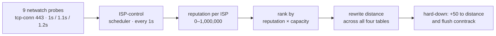

# The control loop

Netwatch only measures; every decision lives in one scheduler-driven script
([why](08-incidents.md#a-controller-that-looked-like-it-was-working)).

The script runs at **two rates**, which matters for reading the numbers below.
Every second it checks one thing: are all of a link's probes down, and if so
get traffic off it. The scoring runs on every tenth pass, so a *tick* is still
ten seconds and every constant here keeps the meaning it had when the whole
script ran at that rate. Speed was bought on the emergency path only.

Leaving a dead link is immediate; moving to a better one is damped. Leaving slowly
would be absurd, and chasing a marginal gain quickly would flap.

- **Severity, not incident count.** A count treats a two-second blip and a
  twelve-minute blackout as one incident each. Reputation is instead an
  asymmetric moving average: each tick it moves 30% of the way toward a sample
  worse than itself, and 0.5% toward one better. A link that fails repeatedly
  never climbs back between failures. The fault is
  [bimodal](01-the-problem.md#the-symptom), so a symmetric average would wash a
  twelve-minute blackout out within the hour.
- **Hysteresis for the tiers.** A tier yields its own link below 500k and
  reclaims it above 800k. The damping is a property of the score; no timer runs
  alongside it — the timer was the part that failed in an earlier design.
- **A hold for the primary.** Promoting a new global primary on quality grounds
  needs a 110% margin, held for fifteen minutes. Failover off a dead primary
  skips both.
- **Fallback to the healthiest link, not the biggest.** Ranking multiplies
  reputation by capacity, so a large link climbing back from an outage can
  outscore a small clean one: on 27 September ISP0 at 32% took second place
  from ISP2 at 97%, two minutes before failing again. A link that has yielded
  its tier now ranks below every link that has not. `main`, which carries the
  router's own DNS for the whole house, likewise leaves a yielded primary for a
  healthy link after the usual hold.

The constants — 30% / 0.5%, 500k / 800k, 110% — were reasoned from one night's
data, not fitted to it. They are plausible, not validated. What the probes can
and cannot see is in [Measurement](07-measurement.md).

---

[← Device tiers](05-tiering.md) · [Measurement →](07-measurement.md)
