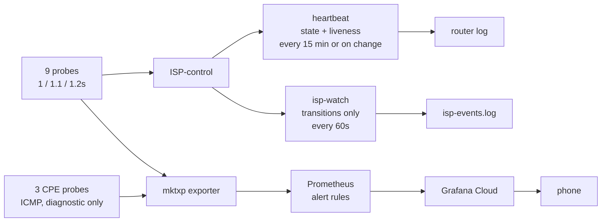

# Measurement

Nine `tcp-conn` probes on port 443 — **three per link, on three different
operators**, so one operator having a bad day cannot read as a link failure. A
link is scored down only when all three agree.

- **Port 443, not ICMP.** Carriers deprioritise and police ping, so ICMP loss
  does not mean traffic loss.
- **Each link gets its own targets.** Probes are pinned by destination address,
  and a destination can route through only one table — so nine distinct
  addresses, not three shared ones.
- **No configured resolver is ever a probe target.** The pins use
  `lookup-only-in-table`, which has no fallthrough; pinning `1.1.1.1` to one
  link would take DNS down with it, turning a single-ISP outage into a total
  one.
- **Targets that can absorb us.** At the current rates that is 72,000–86,000
  connections a day per target. AdGuard measured worse than Google and Quad9 on
  *every* link — by 0.1–0.3%, but consistently, so the target was the problem,
  not the ISPs. Every target since has been measured before adoption rather
  than after: SafeDNS refuses 443 outright and Yandex reset 6 of 8 connections
  in a burst test, and either would have been a probe that failed forever and
  read as an ISP outage.

## The probes

| link | 1s | 1.1s | 1.2s |
|---|---|---|---|
| ISP0 | `8.8.8.8` Google | `76.76.2.0` ControlD | `1.1.1.2` Cloudflare |
| ISP1 | `8.8.4.4` Google | `45.90.28.0` NextDNS | `1.0.0.2` Cloudflare |
| ISP2 | `208.67.220.220` OpenDNS | `194.242.2.2` Mullvad | `1.1.1.3` Cloudflare |

Three things are being balanced in that table, and none of them is obvious.

**The intervals differ on purpose.** netwatch has no phase offset, and entries
created by one apply start together — so probes on the same interval fire in the
same instant, and a momentary stall on the router drops all three on a link at
once, manufacturing a failure that never happened. That artifact was observed
twice on 27 September before it was understood. 1 / 1.1 / 1.2 s keeps them
apart. One second is netwatch's floor; fractional values above it are accepted.

**Rate decides weight.** The loss score is pooled across a link's three probes,
so the fastest probe is the loudest voice. That slot goes to a target that is
both large enough not to care about 86,400 connections a day *and* reaches
across international transit.

**Two of three cross transit; one stays domestic, deliberately.** Traceroutes
in September found Cloudflare and Quad9 terminating at Kathmandu peering while
Google crossed to India — so a set chosen for latency would have measured a path
this household barely uses. Every service the work depends on is abroad. The one
domestic probe is kept as the diagnostic that separates *the link is dead* from
*transit is dead*, and it takes the slowest slot so it carries the least weight.

## Watching our own equipment

Three more probes, ICMP every 10 s, to the CPEs themselves — `192.168.1.254`,
`192.168.2.1`, `192.168.100.1`. They are deliberately outside the control loop:
no `down_script`, a comment the controller does not match, and excluded from the
alert rules. A provider's box dropping off the wire must not move a route by
itself.

They exist because of what the September ISP1 outages turned out to be. The
router was losing its *route* to `192.168.2.1` — a box one hop away, on this side
of the trunk — rather than anything failing in the carrier's network. Nothing in
the instrument set could tell those apart. Now: CPE up while probes fail means
the carrier; both down means the box downstairs.

ICMP here rather than TCP, reversing the rule above, and not as a compromise —
`tcp-conn` is impossible on two of the three. Measured 29 September: ISP1's CPE
serves nothing on TCP from the LAN side and ISP2's refuses 443. A TCP probe
would have sat permanently `down` on exactly the link it was added to watch.

## What the instruments cannot see

- `rtt_max` is the slowest of three probes, one of them international. It
  reports geography, not queue delay, and cannot detect bufferbloat.
- The `jitter` column measures spread between three operators, not link jitter.
- Throughput sampling can report impossible values — 712 Mbps on a 400 Mbps
  line — when two samples land seconds apart. It needs an elapsed-interval
  guard and does not have one.
- Probe state alone is binary, which is why selection is score-based rather
  than binary. Chronic loss does reach the score — a connect whose SYN is lost
  will not retransmit inside a 500 ms timeout, so it registers as a failed test
  and reaches reputation as a ratio. What the count could not see was **latency
  without loss**: a link that degrades from 20 ms to 800 ms still completes
  every connect, so failures stay at zero, loss reads 0%, reputation stays
  perfect, and the link is useless for a call. netwatch thresholds close that —
  a breach sets `status=down`, so degradation is scored exactly like failure,
  with no change to the controller.
- Thresholds are per-target, not global, because the targets differ by 60× —
  Cloudflare answers in 1.6 ms and OpenDNS in 98 ms from the same router. One
  value would be useless at one end and a permanent false alarm at the other.

## Sampling a thing that changes faster than you sample it

The dashboard said one link was in trouble. The router's own log said three
had been. Both were reading the same probes.

`mktxp_netwatch_info` is a **gauge**, scraped every 30 seconds, and it reports
what the probe happens to say at that instant. The events it is meant to catch
last seven seconds. On 28 September six whole-link ISP1 outages were logged by
the router and none of them existed in Grafana — every one fell between two
scrapes. The scrape interval was chosen on the reasoning that 30 s is "finer
than anything being watched here, since the controller acts every 10 s," which
is exactly backwards: because the state changes every 10 s, sampling every 30 s
is *coarser* than the process.

Scraping faster does not fix it. The shortest real event is one lost handshake,
about a second, so catching it by sampling would need sub-second scrapes of an
exporter that opens a RouterOS API session and walks several menus.

The fix is to stop sampling state and start reading **counters**. netwatch keeps
cumulative `done-tests` and `failed-tests` per probe; a seven-second outage is
`+1 failed` whether you scrape every 30 seconds or every five minutes. A counter
integrates; a gauge aliases.

The same argument applies to the controller's own decisions, which existed only
in a log that holds about seven hours. Hard-downs, failovers and yield
transitions are now counters in the script, so the history outlives the log.

**The general form, since it recurs:** ask whether the instrument integrates or
samples, and compare its resolution against the *event*, never against the
process that generates the event.

## From measurement to notification

Liveness, events and alerts are kept deliberately separate — the distinction
Vianet's [ETR messages](02-failure-domains.md#why-it-took-three-days) blurred.



**The heartbeat**, from the controller, every fifteen minutes or on change:

```
ISP-control ENFORCE rep=1000/700/1000 loss=0/1000/0 up=3/0/3
            yield=010 primary=ISP0 tick=29 flush:ISP1@192.168.2.2
```

One line carries liveness *and* state: reputation (in thousands), loss, probes
up, yielded links, the primary, and what changed this tick. `ENFORCE` is
load-bearing: the [12½-hour failover outage](08-incidents.md#twelve-and-a-half-hours-of-no-failover)
showed only as `SHADOW` in an otherwise identical line.

**Events**, from a separate watcher, only on transitions:

| severity | emitted for |
|---|---|
| `CRIT` | all WANs down · only one healthy left · controller not enforcing · controller stalled |
| `WARN` | a link down · router rebooted |
| `INFO` | link recovered · redundancy restored |

The watcher holds only the previous state. It is a different program from
`isp-log.sh`, the five-minute sampler that keeps the loss history: one answers
*what was the loss last Tuesday*, the other *tell me now*, and one program
doing both does neither well.

### Getting it to a person

Detection was never the hard part. On 23 September NTFiber was down for nearly
four hours before anyone knew — and then only from Vianet's SMS about its own
outage. The detector had worked throughout; nothing was watching it.

Prometheus evaluates the rules; Grafana Cloud delivers them:

| alert | fires when | why it exists |
|---|---|---|
| `ISPDown` | all three probes on a link fail for 2 min | three independent operators, so it is the path, not one responder |
| `ISPDegraded` | 1–2 of 3 probes up for 10 min | one operator may simply be unreachable; worth knowing, not worth waking for |
| `NoRedundancy` | one healthy link or fewer, for 5 min | one link left is not an outage, so nothing else reports it — but the next failure *is* one |
| `AllWANsDown` | no healthy link for 2 min | |
| `RouterUnreachable` | the exporter cannot reach the hEX for 3 min | otherwise a dead exporter looks identical to a total outage |

`NoRedundancy` is the one the pole argued for: during the cut, `ISPDown` said
which links were gone; only `NoRedundancy` says the house is one failure from
nothing.

**A trap.** The exporter reports netwatch as an info metric with up/down in a
label, so when every probe on a link fails the "up" series stops existing
rather than reading zero. An alert on `== 0` would go silent exactly when it
mattered. The recording rule supplies an explicit zero from the full probe
set.

**The alert that cannot send itself.** `AllWANsDown` is true precisely when it
cannot reach Grafana Cloud. A total outage can only be seen there as data
*stopping* — open in [Own failure domains](11-own-failure-domains.md).

---

[← The control loop](06-control-loop.md) · [Incidents →](08-incidents.md)
