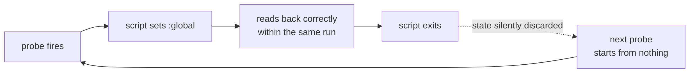
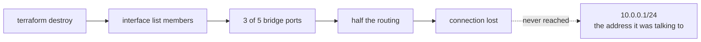

# Incidents

Seven things that went wrong, most of them silently. Each changed the design.

## A controller that looked like it was working

The first version put the decision logic in netwatch's own `up-script` and
`down-script`. It ran for days before anyone noticed it had never made a
decision.

**A script invoked by netwatch cannot persist a `:global`.** The assignment
succeeds and reads back correctly within the run; by the next invocation it is
gone. Every reputation, sample and hold timer silently reset on each probe,
while nine probes ticked every ten seconds and the log filled with plausible
output.

*Fix:* all state moved into one scheduler-driven script. Scheduler-run scripts
can persist globals; nothing in the documentation says netwatch-run ones
cannot.

*Lesson:* a component that produces output is not a component that works. The
test has to be "did the state change", not "is it running".

## The 801 ceiling

Reputation was held per-mille, 0–1000, and recovered with
`(r * 995 + 1000 * 5) / 1000`. At `r = 801` that evaluates to `801995 / 1000`,
which integer-truncates back to **801**. Every link converged there after its
first blemish and stayed, permanently.

With every reputation pinned at the same number, `reputation × capacity`
degenerated into static capacity ordering. Failover still worked;
quality-based selection had stopped existing.

*Fix:* hold reputation per-million. The per-tick increment then sits well above
the truncation floor.

*Lesson:* it was visible for an hour as two links sitting at *exactly* 801 —
an implausible coincidence in a continuous-looking metric. Round numbers in
telemetry deserve suspicion.

## Twelve and a half hours of no failover

The router was power-cycled. The controller re-initialised, defaulted to shadow
mode, and stopped enforcing. Everything looked healthy: the scheduler was
firing, run-count climbing, all reputations fine.

The only difference was one word in a heartbeat line that otherwise reads
exactly like a working one — `SHADOW` instead of `ENFORCE`.

*Fix:* the controller now starts in `ENFORCE`; shadow mode is opt-in from the
terminal, so a reboot cannot disable failover. A separate
[event watcher](07-measurement.md#from-measurement-to-notification) now reports
the controller ceasing to enforce and the router's uptime going backwards —
but only to the event log, not to the phone. That gap is on
[What's next](12-whats-next.md).

*Lesson:* history and "tell me now" are different jobs, and need different
programs.

## Unshaped upload after a migration

When ISP1 was migrated off PPPoE, the commands updated the packet marks but not
the queue tree they feed. `ul-isp1` stayed parented to the deleted interface.
Vianet's upload ran with no fq_codel until an audit caught it.

It does not show in a throughput test, only as latency climbing under load,
and it was found by auditing a stale export, not by anything noticing.

*Fix:* the whole configuration became declarative. Changing a link means
editing one attribute, and every dependent resource moves with it.

*Lesson:* this is the incident the Terraform exists for — a change applied to
four of five places.

## A destroy that cut its own path

Early on, the router's bridge, its ports and its LAN address were all managed
by Terraform. A `destroy` removed the interface list members, three bridge
ports and half the routing, then lost its connection and stopped — one
resource short of deleting the address it was talking to.

*Fix:* the management path is deliberately **not** managed. The bridge, the
wired ports and `10.0.0.1/24` are a documented precondition, in the same
category as the user accounts Terraform also refuses to own.

*Lesson:* a tool that reaches infrastructure in-band cannot safely own the path
it arrives on.

## A wrong diagnosis, and how it was retracted

Outbound SSH failed. Two destinations timed out on port 22 while other ports to
the same address connected, and pinning the source to a different ISP made it
work. The conclusion — that the provider filtered port 22 — seemed strong.

It was wrong. The tests were minutes apart, on a link with a *known
intermittent fault*. Non-simultaneous tests cannot distinguish "filtered" from
"lossy", and a TCP traceroute had already reached the destination on port 22 —
evidence that contradicted the theory and was under-weighted because it
arrived after the conclusion.

*Fix:* the record now says so explicitly, including which signals were
misread. The endpoint workaround adopted meanwhile — `ssh.github.com:443`, SSM
— stays, because a link-pinned routing fix would have been undone by the next
failover anyway.

*Lesson:* correlation on a flapping link is not evidence, and a written-down
**disproven** hypothesis saves the next person an evening.

## Fifteen warnings on a zero-change run

The RouterOS provider emits a warning for every field it reads but does not
model. A converged, no-op apply produces fifteen of them.

They are accurate — about half describe real configuration Terraform cannot
see — but at full weight on every run they train you to skim, which is when a
real warning is missed.

*Fix:* `-compact-warnings`, set once in `terragrunt.hcl`: one line each under
the plan summary instead of burying it.

*Lesson:* an alert that always fires is not an alert.

---

[← Measurement](07-measurement.md) · [Decisions →](09-decisions.md)
