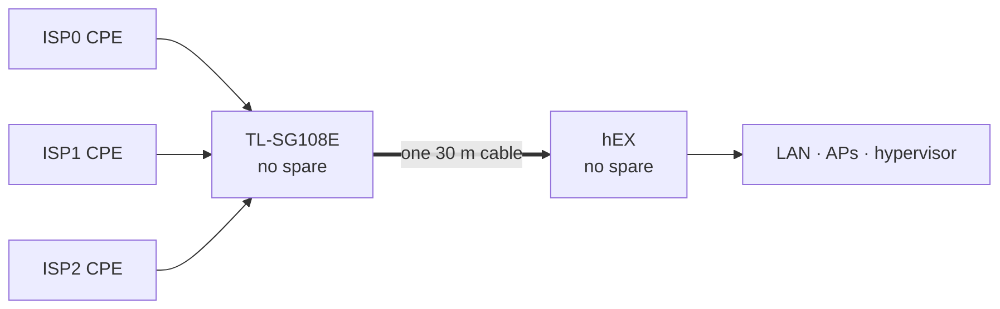

# Own failure domains

The same analysis, turned on this side of the handoff. Three providers
converge on **one switch, one cable and one router** — on the house side there
is exactly one path.

A deliberate trade — defensible only if each piece is named, with what covers
it.

## The register

| domain | status | what covers it |
|---|---|---|
| grid power | **mitigated** | every device in the path has its own mini DC UPS: each ONT, the switch, the hEX and each AP |
| a single UPS failing | **contained** | one battery per device, so a failed unit takes out one device, not the network |
| provider side in a power cut | **the provider's** | GPON's street fibre and splitters are passive; only the provider's exchange needs power |
| the hEX | **accepted** | no spare. Recovery is a replacement unit, the documented bootstrap, then `apply` — which works offline, because the provider plugin is mirrored locally |
| the switch | **accepted** | no spare. It carries all three providers, so its failure is a total outage |
| the 30 m trunk | **accepted** | one cable; a second run was ruled out on distance |
| physical access to the switch | **open** | the switch sits with the CPEs, reachable without entering the house, and ports 5–7 are untagged LAN. See [Architecture](04-architecture.md) |
| the operator | **accepted** | one person understands the controller, the Terraform and the monitoring. The resting state needs no one; a novel fault waits for them |
| alerting during a total outage | **open** | alerts leave over the links they report on, so a total outage can only be seen as data *stopping* at Grafana Cloud |

## Why "accepted" is honest here

The hEX, the switch and the cable are accepted for the same reason: they are
**indoor, powered, rarely touched and cheap**, and none hangs on a pole. The
providers' domains have failed repeatedly; spending first where failures
actually happen is the right order. Accepted is not ignored:

- **The switch is the cheapest fix on this page.** A spare TL-SG108E costs a
  few months of one line, and its configuration is
  [written down](13-runbooks.md#replace-the-switch). Without a spare, a dead
  switch is a total outage until a shop opens.
- **The hEX is covered by the rebuild, not redundancy.** The configuration
  applies offline; what is not covered is the time to get hardware.
- **A mobile data path bypasses all three.** A hotspot on the work laptop
  survives every row in the table, which is why it heads
  [What's next](12-whats-next.md).

## The operator is a domain too

Every design here assumes someone who can read a heartbeat line, run `apply`
and tell a dead exporter from a dead link. There is one such person. Failover,
return, tiering and alerting need nobody; anything new — an unknown failure
mode, a hardware replacement, a provider swap — waits for them. What keeps that
survivable:

- **The resting state is the safe state.** The controller starts enforcing
  after a reboot, so power-cycling the router — the one thing anyone in the
  house can do — cannot make things worse.
- **The configuration and its reasoning are written down.** A rebuild is the
  bootstrap plus `apply`, not recall.
- **The providers' own routers still work.** Each CPE, kept with its Wi-Fi on,
  bypasses the switch, the cable, the hEX and the operator — slower and
  untiered, but needing no one.

## What is not yet measured

The power row says *mitigated*, not *proven*:

- **Runtime is set by the hungriest device.** The units are rated 17 W with an
  8,800 mAh pack — about 27 Wh after conversion, so roughly 5½ hours at 5 W and
  2¼ hours at 12 W. A Wi-Fi 6 ONT or an AP will run out first, and the network
  lasts only as long as the shortest battery among the switch, the hEX and at
  least one ONT. The figures are estimates until a power meter or an unplug test
  replaces them.
- **Changeover is a vendor claim.** Cheap DC UPS units can dip on switchover
  and reboot what is attached. The event watcher flags the hEX's uptime going
  backwards, so one deliberate mains pull answers it.
- **Lithium packs age.** Held at full charge, they lose capacity within a year
  or two. A yearly unplug test catches that.

The alerting row is the same shape: it depends on a no-data alert in Grafana
Cloud, untested until all three CPEs are pulled once. Both drills are in
[Runbooks](13-runbooks.md#drills).

---

[← Exit strategy](10-exit-strategy.md) · [What's next →](12-whats-next.md)
