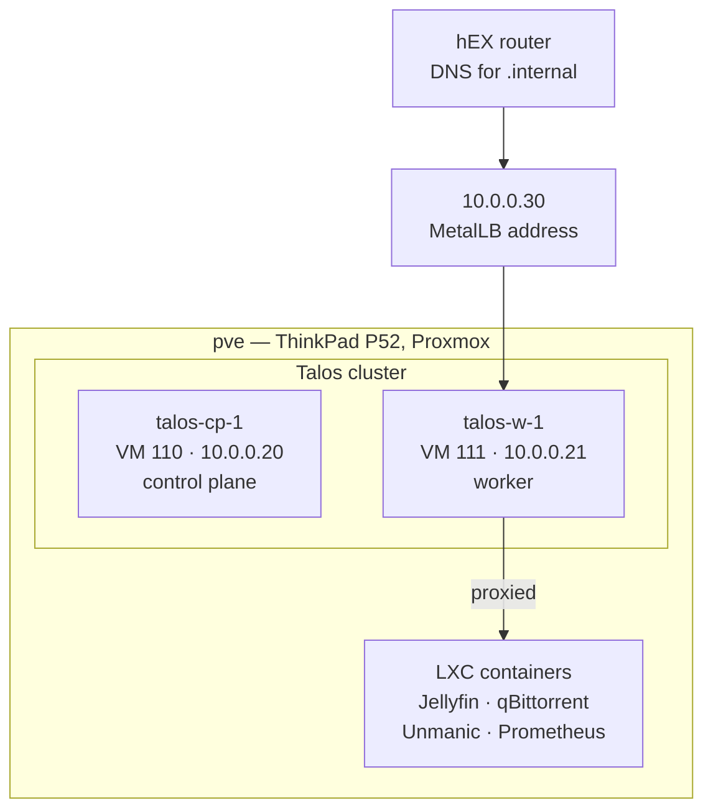
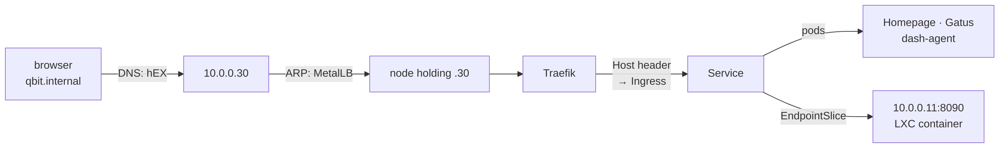

# Architecture

Two VMs on the laptop that already runs everything else, and one address that
every household name resolves to.

## The pieces

| Node | VM | Address | vCPU | RAM | Disk |
|---|---|---|---|---|---|
| `talos-cp-1` (control plane) | 110 | 10.0.0.20 | 2 | 4 GiB | 20 GiB |
| `talos-w-1` (worker) | 111 | 10.0.0.21 | 4 | 10 GiB | 40 GiB |

The Kubernetes API is `https://k8s.internal:6443`, the control plane's own
address — with one control plane there is nothing for a floating address to
float between.

**Talos**, because the OS is an API and a config file: no SSH, no package
manager, nothing to change by hand that could drift. That fits a repository
whose rule is that a re-run with nothing to do reports no changes.

**VMs**, not Kubernetes on the Proxmox host or inside LXC. On the host it
fights Proxmox's own networking and firewall, and a Proxmox upgrade can break
it. Inside LXC it needs privileged containers and kernel tweaks, and fails in
confusing ways.

**Two nodes, one laptop.** Enough to practise scheduling, draining and
upgrades. Nothing about surviving hardware failure: both nodes share one
failure domain, the laptop.

## What runs where

| | Where | Name |
|---|---|---|
| Homepage | cluster | https://home.internal |
| Gatus | cluster | https://gatus.internal |
| dashboard feeds, ISP watcher and sampler | cluster, `homenet` | http://dash.internal |
| Proxmox UI | pve, proxied | https://proxmox.internal |
| qBittorrent, Unmanic | LXC, proxied | https://qbit.internal, https://unmanic.internal |
| Jellyfin | LXC, proxied | http(s)://jellyfin.internal |
| switch UI | the switch, proxied | https://tplink.internal |
| Prometheus | LXC | `10.0.0.6:9090`, not proxied |

## A request, end to end

Covered in [Getting traffic in](04-getting-traffic-in.md) and
[HTTPS](05-https.md).

## The dependency this created

Every `<name>.internal` web address now goes through the cluster. If both
Talos VMs are down, `jellyfin.internal` answers nothing — even though Jellyfin
itself is fine in its container.

The way round it was kept deliberately: every container also has a
`<name>-ct.internal` name pointing straight at it, and pve is
`https://pve.internal:8006` directly. They appear in
[Runbooks](11-runbooks.md) as the first thing to try when the cluster is the
problem.

Measurement does not depend on it in the same way. The router's controller,
its probes and its failover run on the router; Prometheus runs in its own
container. What the cluster holds is the event *log* and the dashboard —
losing it loses visibility of an outage, not the failover from it.
