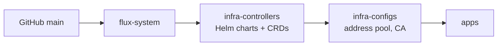

# GitOps

A push to `main` is the deploy. Nothing is applied by hand except three
secrets, and those are waiting on [SOPS](10-whats-next.md).

## Pull, because nothing can push in

All three ISPs put the house behind carrier-grade NAT. No service on the
internet can open a connection to anything here, so GitHub cannot deliver a
deployment. Something inside has to fetch it.

**Flux** does that. It runs in the cluster, checks the repository every
minute, and applies whatever `main` says. It reaches GitHub with a read-only
deploy key, created by `flux bootstrap`: the cluster can read this repository
and nothing else, and cannot write to it.

## Layout and order

```
kubernetes/
  clusters/home/           Flux's entry point; flux-system/ is written by bootstrap
    infrastructure.yaml    two Kustomizations: controllers, then configs
    apps.yaml              depends on configs
  infrastructure/
    controllers/           MetalLB, Traefik, cert-manager, local-path-provisioner,
                           metrics-server, kubelet-serving-cert-approver
    configs/               MetalLB's address pool, the private CA
  apps/                    gatus, homepage, homenet, lan-proxy
  images/homenet-agent/    built by .github/workflows/homenet-agent.yaml
```

The split exists because of CRDs. MetalLB's `IPAddressPool` and cert-manager's
`Certificate` are custom resources; they cannot be applied until the
controller that defines them is installed. So:



Each step waits for the previous one to be healthy. The cost of that is
visible in [Incidents](08-incidents.md): one unhealthy controller holds up
every app behind it.

## What a change looks like

- **Change an app:** edit its `helmrelease.yaml` or manifests, push. Flux
  picks it up within a minute; `flux reconcile kustomization flux-system
  --with-source` only skips the wait.
- **Add an app:** a directory under `apps/` with an Ingress for
  `<name>.internal`, a line in `apps/kustomization.yaml`, and one DNS record in
  [`../../home-network/terraform/addressing.tf`](../../home-network/terraform/addressing.tf).
- **Change a script** in `apps/homenet/scripts/`: push. The scripts are a
  ConfigMap with a content hash in its name, so a change rolls the pods.
- **Change the image** in `images/homenet-agent/`: bump `VERSION`, push, wait
  for the workflow, then move the pin in the manifests. A rebuild never
  changes what is running until the pin moves.

Charts are pinned to exact versions; images too, where a chart allows it.

## What is not GitOps

- **The VMs and Talos** are Terraform, in [`../talos/`](../talos/README.md),
  applied by hand — the same as the router.
- **DNS records** are in the router's Terraform.
- **Three secrets** are created with `kubectl`, listed in
  [State and secrets](07-state-and-secrets.md).
- **The Proxmox host itself** — fan curve, battery limits, the power script —
  is not managed by anything yet.

## Rejected

- **A self-hosted GitHub Actions runner.** On a repository written to be
  public, it lets any pull request run code on the hypervisor.
- **A hand-written sync agent.** It would work, and it would be one more thing
  to maintain that exists only here.
- **Ansible from the laptop.** Fine for configuration in containers, but it is
  push-based, and the cluster made pull-based reconciliation available for
  free.
- **Komodo, Portainer, doco-cd.** GitOps for Docker Compose only; most of what
  needed managing was not Compose.
