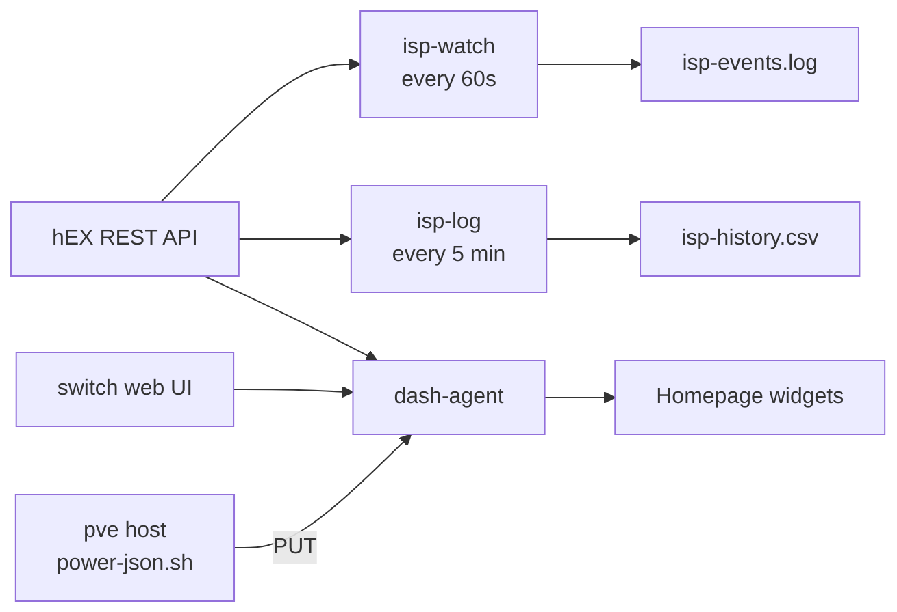

# Dashboard and ISP monitoring

The cluster runs the household dashboard, its data feeds, and the two jobs
that keep the record of every ISP outage.

## Homepage

[Homepage](https://gethomepage.dev) at `https://home.internal`: the household
services, the Proxmox host's resources, router and switch state, and a Cluster
group showing pod status read straight from the Kubernetes API — which is why
it carries a ServiceAccount and a read-only ClusterRole.

It is deployed with the bjw-s `app-template` chart rather than the community
Homepage chart, which ships Homepage v1.2.0; `app-template` runs whatever
image it is given (v2.4.0). A small script in its config makes the theme
follow the operating system's light or dark setting live.

Two details matter when changing it:

- **Homepage answers 400 to any `Host` header it was not told about**
  (`HOMEPAGE_ALLOWED_HOSTS`). Every name a request can arrive with must be
  listed, including the in-cluster name Gatus uses.
- **Its one secret**, the Proxmox widget's API token, lives only in a
  Kubernetes Secret and is substituted into the config at runtime.

## homenet

Everything else lives in the `homenet` namespace:

| | Runs | Does |
|---|---|---|
| `dash-agent` | Deployment | serves `wan.json` and `switch.json`, running a collector when Homepage asks, with a floor so an open tab cannot hammer the router or the switch; keeps the last good `power.json` |
| `isp-watch` | CronJob, every minute | notices WAN state changes and appends them to `isp-events.log` |
| `isp-log` | CronJob, every 5 minutes | per-ISP loss and throughput from the router's counters, `isp-history.csv` |

`power.json` — battery, fan and CPU temperature — can only be read on the
Proxmox host, so the host PUTs it to `http://dash.internal/power.json` every
minute. `dash-agent` keeps it only if it looks like a real reading.

`isp-events.log` is not a nice-to-have. It is the timestamped dropout record
behind the complaint against a provider in
[The problem](../../home-network/docs/01-the-problem.md). Everything about how
these jobs are deployed follows from not being allowed to lose it, or to write
anything false into it.



### Scripts and image

The jobs are shell scripts (and one small Python HTTP server) in
[`apps/homenet/scripts/`](../apps/homenet/scripts/), shipped as a ConfigMap:
changing one is a commit. Paths come from environment variables, so the same
files run anywhere.

They parse router output with `awk`, and `awk` implementations differ. So the
image ([`images/homenet-agent`](../images/homenet-agent/Dockerfile)) is
Debian 13 with Python 3.13 and curl — the toolset the scripts were written
against, `mawk` included — rather than a smaller Alpine image whose busybox
tools would *probably* behave the same. It holds only tools, is built by
GitHub Actions when its `VERSION` changes, and runs as `nobody` with a
read-only root filesystem.

### The test that mattered

Before the jobs were deployed, the image was built on the Proxmox host and all
four scripts were run against the **real router and switch**, writing to a
scratch copy of the logs.

The switch scrape worked. Every router call returned **401**. In the scratch
log, `isp-watch` had appended:

```
2026-10-09T07:02:58+00:00  CRIT    ALL WANS DOWN
```

All three ISPs were up. The router's `homepage` account only accepts logins
from listed addresses, and the worker's — 10.0.0.21, which every pod's traffic
to the router comes from — was not on the list. `isp-watch` reads "cannot ask
the router" as "no WAN is up".

Deployed as it was, that would have written a false total outage into the
record used as evidence against a provider. The fix was one line on the
router; the lesson was to test a monitor against the real thing it monitors,
somewhere disposable, before it writes to anything that matters.

### Deploying without two writers

The CronJobs were first deployed **suspended**. The existing history and
counter state were loaded into the volume, and only then were the CronJobs
enabled — so there was never a moment with two copies of the jobs writing the
same log or racing the same counter baselines.

`isp-log` measures loss as a difference between cumulative counters, so a
pause between runs makes the next row cover a longer interval rather than
losing data.
